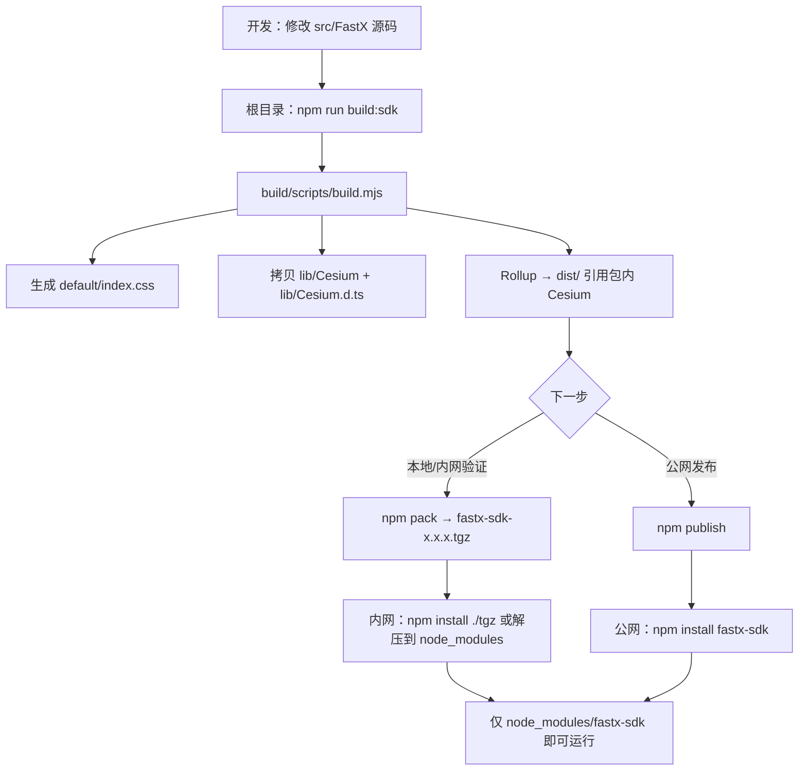

# fastx-sdk 打包与发布指南

本文档说明 `src/FastX/build` 目录的作用、各文件夹含义、从本地构建到 npm 发布的完整流程，以及**内网/离线**场景下如何使用 `.tgz` 包。

---

## 一、两个层次：源码 vs 发布包

| 层次 | 路径 | 作用 |
|------|------|------|
| **SDK 源码** | `src/FastX/`（Layer、Draw、Coordinates…） | 日常开发、新增功能 |
| **npm 包工作区** | `src/FastX/build/` | 打包配置 + 构建产物，发布为 `fastx-sdk` |

- Demo 工程（`npm run dev`）直接引用 `src/FastX` 源码，改完即生效。
- npm 用户安装后使用的是 `build/dist/` 里打包好的 JS，不会看到你的 `.ts` 源码。

---

## 二、`build` 目录下各文件夹说明

```text
src/FastX/build/
├── dist/                    【构建产物】Rollup 输出的 JS + 类型（每次 build 重新生成）
├── lib/Cesium/              【构建产物】完整 Cesium 运行时（index.js + Workers/Assets/Widgets）
├── lib/Cesium.d.ts          【构建产物】Cesium TypeScript 类型（declare module "cesium"）
├── default/                 【构建产物】index.css（含 Cesium Widgets 样式）
├── scripts/build.mjs        【源码】构建脚本
├── runtime/                 【源码】ensure-cesium-base-url.ts
├── stubs/                   【源码】Vue 组件占位（npm 包不含 Vue）
├── entry.ts                 【源码】Rollup 入口，引用 ../index.ts
├── rollup.config.js         【源码】Rollup 配置
├── tsconfig.json            【源码】打包用 TS 配置
├── package.json             【源码】npm 包元信息
├── README.md                【源码】npm 包首页（publish 时展示）
├── PUBLISH-GUIDE.md         【源码】本指南（维护者文档，默认不随 npm 发布）
├── .gitignore               【源码】忽略 dist / lib / default / *.tgz
└── fastx-sdk-x.x.x.tgz      【本地产物】npm pack 生成，勿提交 Git
```

### `dist/` — 给使用者 import 的 JS

| 文件 | 用途 |
|------|------|
| `fastx.esm.js` | ESM：`import { FastX } from 'fastx-sdk'` |
| `fastx.cjs.cjs` | CommonJS：`require('fastx-sdk')` |
| `entry.d.ts` | TypeScript 类型 |
| `*.map` | Source Map，便于调试 |

`package.json` 的 `main` / `module` / `types` 均指向此目录。

### `lib/Cesium/` + `lib/Cesium.d.ts` — 完整 Cesium（内网自包含）

构建时从 `node_modules/cesium/Build/Cesium` 整目录拷贝，包含：

| 内容 | 说明 |
|------|------|
| `index.js` / `index.cjs` | Cesium JavaScript API（`Viewer`、`Entity` 等） |
| `Workers/` | Web Worker 脚本 |
| `Assets/` | 地形、图标等资源 |
| `Widgets/` | 控件相关静态文件 |
| `lib/Cesium.d.ts` | 从 `Source/Cesium.d.ts` 拷贝的类型声明 |

`dist/fastx.esm.js` 运行时引用 **`../lib/Cesium/index.js`**（包内路径），**不**再依赖 `node_modules/cesium`。  
`dist/entry.d.ts` 顶部注入 `/// <reference path="../lib/Cesium.d.ts" />`，TypeScript 同样无需安装 `cesium` 包。

`installFastXToWindow()` / `ensureCesiumBaseUrl()` 将 `CESIUM_BASE_URL` 指向包内 `lib/Cesium/`。

### `default/` — 样式

`index.css` 由构建脚本从 Cesium 的 `widgets.css` 生成，使用方：

```typescript
import 'fastx-sdk/default/index.css'
```

### 其他源码文件

| 路径 | 说明 |
|------|------|
| `entry.ts` | 打包入口，聚合 `src/FastX/index.ts` 导出 |
| `stubs/` | 替换 Vue 组件引用，避免把 Demo 组件打进 npm 包 |
| `runtime/ensure-cesium-base-url.ts` | 自动设置 `window.CESIUM_BASE_URL` |

---

## 三、自包含设计：使用者无需安装 `cesium`

`fastx-sdk` 的 `package.json` **没有** `dependencies` / `peerDependencies` 中的 `cesium`。

| 构建时（维护者 monorepo） | 发布包内（使用者） |
|---------------------------|-------------------|
| 从根目录 `node_modules/cesium` 拷贝 | `lib/Cesium/index.js` + Workers/Assets |
| 拷贝 `Source/Cesium.d.ts` | `lib/Cesium.d.ts` |
| Rollup `output.paths` 重定向 | `dist/*.js` 中 `import '../lib/Cesium/index.js'` |

因此：

- **公网**：`npm install fastx-sdk` 即可，不会再去 registry 拉 `cesium`
- **内网 / 离线**：拷贝 `fastx-sdk-x.x.x.tgz`，本地安装或解压到 `node_modules/fastx-sdk`，**一个包搞定**

可选导出：

```typescript
import { Cesium } from 'fastx-sdk'
// 或
import * as Cesium from 'fastx-sdk/cesium'
```

---

## 四、Vite / Webpack 集成指南（公网 / 内网均必读）

### 4.1 为什么需要额外配置？

`fastx-sdk` 自包含 Cesium 的 **JS + Workers + Assets**，但 Cesium 的 Workers/Assets 必须在浏览器里通过 **HTTP URL** 加载（不能被打进 JS bundle）。

| 阶段 | 典型现象 |
|------|----------|
| `npm run dev` | 有时正常（dev 服务器还能访问 `node_modules`） |
| `npm run build` | **通常能成功**，不报错 |
| 打开 build 后的页面 | **容易白屏**；Network 里 `Workers/*.js`、`Assets/*.json` **404** |

原因：`fastx-sdk` 被 Vite/Webpack **二次打包**进 `assets/index-xxx.js` 后，自动推断的 `CESIUM_BASE_URL` 失效，浏览器去错误路径找静态资源。

**结论**：与内网/外网无关；只要使用 **Vite 或 Webpack 构建前端**，就必须按下面方式处理 Cesium 静态资源。

### 4.2 统一约定

全项目使用同一前缀（下文以 **`/Cesium/`** 为例）：

1. 构建时把 `node_modules/fastx-sdk/lib/Cesium/` 复制/代理到站点 **`/Cesium/`** 路径
2. 运行时告知 SDK：

```typescript
import 'fastx-sdk/default/index.css'
import { FastX, installFastXToWindow } from 'fastx-sdk'

installFastXToWindow({ cesiumBaseUrl: '/Cesium/' })
```

若站点部署在子路径（如 `https://example.com/gis/`），则改为：

```typescript
installFastXToWindow({ cesiumBaseUrl: '/gis/Cesium/' })
```

Vite 的 `base` 为 `/gis/` 时，`cesiumBaseUrl` 必须为 **`/gis/Cesium/`**（与 `vite.config` 中插件参数一致）。

### 4.3 Vite 方案（推荐：官方插件）

`fastx-sdk` 自带 **`fastx-sdk/vite-plugin`**，负责：

- **开发**：dev server 中间件代理 `/Cesium/` → 包内 `lib/Cesium/`
- **生产**：`closeBundle` 时将 `lib/Cesium/` 复制到 `dist/Cesium/`
- **注入**：`globalThis.__FASTX_CESIUM_BASE__`（与 `installFastXToWindow` 配合）

#### 安装

```bash
npm install fastx-sdk
# 无需安装 cesium；无需 vite-plugin-cesium
```

#### `vite.config.ts`

```typescript
import { defineConfig } from 'vite'
import vue from '@vitejs/plugin-vue' // 若使用 Vue
import { vitePluginFastxSdk } from 'fastx-sdk/vite-plugin'

const CESIUM_BASE = '/Cesium/'

export default defineConfig({
  plugins: [
    vue(),
    vitePluginFastxSdk({ cesiumBaseUrl: CESIUM_BASE }),
  ],
  // 若部署到子路径，例如 base: '/gis/'，则：
  // const CESIUM_BASE = '/gis/Cesium/'
  // base: '/gis/',
})
```

#### `main.ts`

```typescript
import 'fastx-sdk/default/index.css'
import { FastX, installFastXToWindow } from 'fastx-sdk'

installFastXToWindow({ cesiumBaseUrl: '/Cesium/' })

// 初始化地图
FastX.Layer.initMap({ /* ... */ })
```

#### 验证（build 后必做）

```bash
npm run build
npm run preview   # 或部署 dist/
```

浏览器 DevTools → **Network**，过滤 `Cesium`，应看到：

- `GET /Cesium/Workers/...` → **200**
- `GET /Cesium/Assets/approximateTerrainHeights.json` → **200**

Console 执行 `window.CESIUM_BASE_URL`，应以 `/Cesium/` 结尾（或完整 URL 含 `/Cesium/`）。

本地 `dist/` 目录应存在 **`dist/Cesium/Workers/`**（插件在 `closeBundle` 时复制）。

---

### 4.4 Webpack 方案

Webpack 无内置插件，使用 **`copy-webpack-plugin`** 复制静态资源 + **`DefinePlugin`** 注入 BASE URL（与 SDK 内置逻辑一致）。

#### 安装依赖

```bash
npm install fastx-sdk copy-webpack-plugin webpack --save-dev
# copy-webpack-plugin 需 webpack 5；若项目已有 webpack 5，只加 copy-webpack-plugin 即可
```

#### `webpack.config.js`（Webpack 5）

```javascript
const path = require('path')
const webpack = require('webpack')
const CopyWebpackPlugin = require('copy-webpack-plugin')

/** 与 installFastXToWindow({ cesiumBaseUrl }) 保持一致 */
const CESIUM_BASE = '/Cesium/'

module.exports = {
  mode: 'production',
  entry: './src/main.ts',
  output: {
    path: path.resolve(__dirname, 'dist'),
    filename: 'assets/[name].[contenthash].js',
    publicPath: '/', // 若部署子路径改为 '/gis/'
  },
  plugins: [
    // 1. 生产构建：复制 Cesium 静态资源到 dist/Cesium/
    new CopyWebpackPlugin({
      patterns: [
        {
          from: path.resolve(__dirname, 'node_modules/fastx-sdk/lib/Cesium'),
          to: 'Cesium',
        },
      ],
    }),
    // 2. 注入 BASE URL（与 vite-plugin 相同机制）
    new webpack.DefinePlugin({
      'globalThis.__FASTX_CESIUM_BASE__': JSON.stringify(CESIUM_BASE),
    }),
  ],
  devServer: {
  // 3. 开发环境：直接托管 node_modules 中的 Cesium
    static: [
      {
        directory: path.resolve(__dirname, 'node_modules/fastx-sdk/lib/Cesium'),
        publicPath: CESIUM_BASE.replace(/\/$/, ''), // '/Cesium'
      },
    ],
  },
  resolve: {
    extensions: ['.ts', '.js'],
  },
  module: {
    rules: [
      { test: /\.ts$/, use: 'ts-loader', exclude: /node_modules/ },
    ],
  },
}
```

#### `src/main.ts`

```typescript
import 'fastx-sdk/default/index.css'
import { FastX, installFastXToWindow } from 'fastx-sdk'

installFastXToWindow({ cesiumBaseUrl: '/Cesium/' })

FastX.Layer.initMap({ /* ... */ })
```

#### Webpack 验证（与 Vite 相同）

```bash
npm run build
npx serve dist   # 或任意静态服务器
```

检查：

- `dist/Cesium/Workers/` 目录存在且非空
- 浏览器 Network 中 `/Cesium/Workers/...` 为 **200**
- 地图正常渲染，无白屏

---

### 4.5 不使用构建工具（纯 ESM / Node 直引）

若**不**经过 Vite/Webpack 二次打包，直接加载 `node_modules/fastx-sdk/dist/fastx.esm.js`：

```typescript
import 'fastx-sdk/default/index.css'
import { installFastXToWindow, FastX } from 'fastx-sdk'

installFastXToWindow() // 可不带 cesiumBaseUrl，SDK 会自动推断包内 lib/Cesium
```

需通过 **HTTP 服务器** 访问（不能用 `file://` 打开）。内网解压 `.tgz` 到 `node_modules/fastx-sdk` 后同样适用。

---

### 4.6 故障排查速查

| 现象 | 可能原因 | 处理 |
|------|----------|------|
| build 成功，页面白屏 | 未复制/未代理 `lib/Cesium` | 按 4.3 / 4.4 配置 |
| `Workers/xxx.js 404` | `CESIUM_BASE_URL` 与实际静态路径不一致 | 统一为 `/Cesium/`，检查 `installFastXToWindow({ cesiumBaseUrl })` |
| dev 正常，build 后挂 | 仅 dev 能访问 node_modules | 确认生产构建产物含 `dist/Cesium/` |
| 部署子路径后 404 | BASE 未含子路径前缀 | 改为 `/子路径/Cesium/` |
| `npm run build` 报错 | 路径解析 / loader 问题 | 确保 `fastx-sdk` 在 `node_modules` 且版本完整（含 `lib/`） |

---

## 五、内网 / 离线使用流程

### 维护者（有外网或已装好 monorepo 依赖）

```bash
# 仓库根目录
npm install          # 仅维护者构建时需要 cesium
npm run build:sdk
cd src/FastX/build
npm pack             # → fastx-sdk-1.0.1.tgz
```

将 `.tgz` 拷入内网（U 盘、内网文件服务器等）。

### 内网使用者

**方式 A：npm 本地安装（推荐）**

```bash
npm install ./fastx-sdk-1.0.1.tgz
```

**方式 B：手动解压**

```bash
mkdir -p node_modules/fastx-sdk
tar -xzf fastx-sdk-1.0.1.tgz -C node_modules/fastx-sdk --strip-components=1
```

Windows 可用 7-Zip 等解压，保证最终目录为 `node_modules/fastx-sdk/`，且包含 `package.json`、`dist/`、`lib/`。

**方式 C：内网私有 npm**

```bash
npm publish --registry http://内网-registry/
# 使用者
npm install fastx-sdk --registry http://内网-registry/
```

### 内网项目代码

> **若内网项目使用 Vite / Webpack 构建**，必须先按 [第四节](#四vite--webpack-集成指南公网--内网均必读) 配置，再使用下列代码。

```typescript
import 'fastx-sdk/default/index.css'
import { FastX, installFastXToWindow } from 'fastx-sdk'

// Vite / Webpack 项目（推荐显式指定，与构建配置一致）
installFastXToWindow({ cesiumBaseUrl: '/Cesium/' })

// 无二次打包时可简写：installFastXToWindow()

FastX.Layer.initMap({ /* ... */ })
```

### 内网部署注意

1. **Vite / Webpack 项目**：见 [第四节](#四vite--webpack-集成指南公网--内网均必读)；`npm run build` 成功后仍需确认 `dist/Cesium/` 与 Network 200。
2. **纯 ESM / 无打包工具**：`installFastXToWindow()` 可自动推断包内路径；须 HTTP 访问，且保留完整 `dist/` + `lib/` 目录结构。
3. **包体积**：含完整 Cesium，`fastx-sdk-1.0.1.tgz` 约 **15～25 MB**，属正常现象。

---

## 六、在 `src/FastX` 新增功能后如何更新 npm 包？

1. 在 `src/FastX/` 下正常开发（新模块、改 `index.ts` 导出等）。
2. 在仓库根目录执行：

   ```bash
   npm run build:sdk
   ```

3. Rollup 会从 `entry.ts` → `../index.ts` 重新扫描并打包，`dist/` **整目录覆盖**。
4. 若对外 API 有变，酌情更新 `build/README.md`、升级 `build/package.json` 的 `version`。
5. 本地验证：`cd src/FastX/build && npm pack`，解压 `.tgz` 检查内容。
6. 发布：`npm publish`（见下文）。

**注意**：`dist/`、`lib/`、`default/` 不要手改，一律由构建脚本生成。

---

## 七、完整流程图



---

## 八、命令步骤（维护者）

### 1. 构建

在**仓库根目录**（需已 `npm install`）：

```bash
npm run build:sdk
```

等价于：

```bash
cd src/FastX/build
npm run build
```

构建步骤（`scripts/build.mjs`）：

1. 校验 `README.md` 存在
2. 生成 `default/index.css`
3. 拷贝 `node_modules/cesium/Build/Cesium` → `lib/Cesium/`
4. 拷贝 `Source/Cesium.d.ts` → `lib/Cesium.d.ts`
5. Rollup 打包 → `dist/`（JS 引用 `../lib/Cesium/index.js`）
6. 为 `dist/entry.d.ts` 注入 Cesium 类型引用

### 2. 本地打包验证

```bash
cd src/FastX/build
npm pack
```

生成 `fastx-sdk-<version>.tgz`，可：

```bash
# 查看包内文件列表
tar -tzf fastx-sdk-1.0.1.tgz

# 在其它项目中试装
npm install /path/to/fastx-sdk-1.0.1.tgz
```

### 3. 发布到 npm

```bash
cd src/FastX/build
npm login                    # 首次
npm publish --access public  # 公开包；scoped 包按账号策略加 --access
```

- `prepublishOnly` 会在发布前**自动再执行一次 build**。
- 每个 `version` 只能发布一次，需改版本号才能再发。
- 发布前确认 `package.json` 中 `name`、`version` 正确。

### 4. 使用者安装（公网 / 内网）

```bash
# 公网
npm install fastx-sdk

# 内网
npm install ./fastx-sdk-1.0.1.tgz
```

```typescript
import 'fastx-sdk/default/index.css'
import { FastX, installFastXToWindow, Cesium } from 'fastx-sdk'

// Vite / Webpack 项目见第四节
installFastXToWindow({ cesiumBaseUrl: '/Cesium/' })

FastX.Layer.initMap({ /* ... */ })
```

---

## 九、npm 上如何存储？

```text
registry.npmjs.org
├── 包元数据（name、version、description、exports…）  → npmjs.com 页面
├── README.md                                      → 包首页文档
└── fastx-sdk-<version>.tgz                        → 实际文件（CDN）
```

用户安装后目录（**仅有 fastx-sdk，无 cesium**）：

```text
node_modules/fastx-sdk/
├── package.json          ← dependencies 为空
├── README.md
├── dist/
│   ├── fastx.esm.js      ← import '../lib/Cesium/index.js'
│   ├── fastx.cjs.cjs
│   └── entry.d.ts        ← reference ../lib/Cesium.d.ts
├── lib/
│   ├── Cesium/
│   │   ├── index.js      ← 完整 Cesium JS
│   │   ├── index.cjs
│   │   ├── Workers/
│   │   └── Assets/
│   └── Cesium.d.ts       ← TS 类型
└── default/index.css
```

## 十、版本号与发版检查清单

- [ ] `src/FastX` 功能与导出已完成
- [ ] `npm run build:sdk` 成功（含 verify 校验）
- [ ] `build/package.json` 的 `version` 已递增
- [ ] `npm pack` 解压检查 `dist` / `lib/Cesium/index.js` / `lib/Cesium.d.ts` / `default` / `README.md` / `vite-plugin.mjs`
- [ ] 在 Vite 或 Webpack 示例项目中试装并 `npm run build`，确认 `dist/Cesium/Workers` 可访问
- [ ] 内网试装：`npm install ./fastx-sdk-x.x.x.tgz` 后地图能正常加载
- [ ] `npm publish`（或先发到私有 registry 验证）

---

## 十一、常见问题

**Q：外网 Vite 项目 `npm run build` 成功但地图白屏？**  
A：build 阶段通常不报错；是运行时 Workers 404。按 [第四节 Vite 方案](#43-vite-方案推荐官方插件) 配置 `vitePluginFastxSdk` + `installFastXToWindow({ cesiumBaseUrl: '/Cesium/' })`，并检查 Network。

**Q：Webpack 项目怎么配？**  
A：见 [第四节 Webpack 方案](#44-webpack-方案)：`copy-webpack-plugin` + `DefinePlugin` + `devServer.static`。

**Q：内网解压 `.tgz` 后地图白屏？**  
A：若用 Vite/Webpack，与公网相同，必须按第四节配置；若无打包工具，检查是否调用 `installFastXToWindow()`、是否 HTTP 访问、Network 里 Workers 是否 404。

**Q：`fastx-sdk-1.0.1.tgz` 要提交 Git 吗？**  
A：不要。仅分发/测试用，已加入 `build/.gitignore` 的 `*.tgz`。

**Q：改了 `src/FastX` 但 npm 用户没变化？**  
A：需要重新 `build:sdk` 并发布/重新分发新版本 `.tgz`。

**Q：维护者 monorepo 还需要 cesium 吗？**  
A：需要。构建时从根目录 `node_modules/cesium` 拷贝进包；**使用者**不需要。

**Q：Demo 和 npm 包会冲突吗？**  
A：不会。Demo 用 monorepo 源码；npm 包是独立构建产物。
